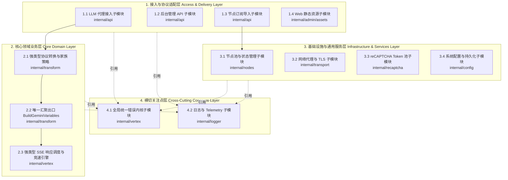

# AGENTS.md — Vertex AI Proxy 工程指南

本文件供 AI Agent 与开发者查阅：记录项目**四层主架构 + 12 个领域子模块**的物理文件映射、单文件行数审查准则以及代码修改后的校验指令。

---

## 一、 架构总览（四层主架构 + 12 领域子模块）



## 二、 物理文件映射总表

| 主层分类 | 序号 | 领域子模块 | 主要文件与职责切片 |
| :--- | :--- | :--- | :--- |
| **1. 接入与协议适配层** | 1.1 | LLM 代理接入 | `gemini_handler.go`、`chat_handler.go`、`image_handler.go`、`audio_handler.go` |
| | 1.2 | 后台管理 API | `admin_nodes_crud.go`、`admin_nodes_action.go`、`admin_handler.go` |
| | 1.3 | 节点订阅导入 | `admin_import_uri.go`、`admin_import_v2ray.go`、`admin_import_clash.go`、`admin_import_parser.go` |
| | 1.4 | Web 静态资源 | `base.css` / `components.css` / `pages.css`、`page-nodes-api.js` / `page-nodes-ui.js`、`page-appearance-api.js` / `page-appearance-ui.js` |
| **2. 核心领域业务层** | 2.1 | 强类型协议转换与家族策略 | `dto.go` / `oai_dto.go`（强类型 DTO 基座）、`adaptor.go` / `text_adaptor.go`（协议适配器）、`strategy_*.go`（文本/图像/语音三家族策略）、`policy.go`（思考/模态纯函数）、`signature.go`（思维链签名决策器） |
| | 2.2 | 唯一汇聚出口 | `request_variables.go`（**唯一终极汇聚出口 `BuildGeminiVariables`**：收拢历史思维链签名注入、Native Tools Schema 转换、同 Role 连续消息合并、空 Part 过滤与包壳） |
| | 2.3 | 强类型 SSE 调度与竞速引擎 | `stream_typed.go`（OpenAI SSE 增量剥离空 Name 键与工具追踪）、`core_typed.go`（UNSPECIFIED 清洗）、`race_engine.go` / `racing.go`（泛型 `RunRace[T]` 强类型通道隔离） |
| **3. 基础设施与通用服务** | 3.1 | 节点池与状态管理 | `store_mem.go`、`store_db.go`、`store_health.go` |
| | 3.2 | 网络代理与 TLS | `codec_uri.go`、`codec_protocols.go`、`sing_box_builder.go`、`sing_box_dialer.go` |
| | 3.3 | reCAPTCHA Token 池 | `recaptcha.go`、`pool.go` |
| | 3.4 | 系统配置与持久化 | `config.go`、`provider.go` |
| **4. 横切关注点层** | 4.1 | 全局统一错误内核 | `internal/vertex/errors.go` |
| | 4.2 | 日志与 Telemetry | `internal/logger/logger.go`、`internal/telemetry/client.go` |

> 说明：`internal/` 保持物理目录扁平，新增功能或重构切片需遵循 **package 内按文件名语义切分** 原则（零破坏重构），不改变包名与对外导出签名。

## 三、 单文件规模分级审查线与测试规范

| 规模区间 | 判定 |
| :--- | :--- |
| < 300 行 | 绿色健康区（理想状态） |
| 300 ~ 400 行 | 正常核心业务区 |
| 400 ~ 500 行 | 预警审视区（检查多重职责，能拆则拆） |
| > 500 行 | 特许例外区（纯数据映射表、不可分割单一协议解析器） |

> **说明**：行数线为**预警指导指标**而非硬性阻断红线。代码治理核心原则是**单一职责原则（SRP）**与**高内聚低耦合**。严禁为了凑行数而盲目拆分逻辑紧密的代码块或削减有效测试用例。

### 测试文件专项规范：
1. **行数上限与弹性**：单个 `*_test.go` 文件原则上建议控制在 **600 行**以内。若包含大量表驱动测试数据（Table-Driven Test Fixtures）或 Mock 报文，且保持单一测试职责，可作为合理例外保留；对于混合了多子场景的超长测试，需按子场景拆分（如 `sing_box_dialer_test.go` 与 `sing_box_dialer_diag_test.go`）。
2. **旁路测试原则（Colocated Testing）**：测试代码必须与被测业务逻辑处于同一 package，并采用 1 对 1 文件命名对齐（如 `auth.go` 对应 `auth_test.go`）。**严禁创建 `refactor_test.go`、`temp_test.go` 或 `fix_test.go` 等临时性/大一统测试文件**。重构或临时修复新增的测试用例必须在验证后及时归位至对应模块的标准测试文件中。
3. **测试执行性能**：单元测试单用例耗时原则上控制在 **500ms** 以内。**严禁硬编码大额休眠（如 `time.Sleep(10 * time.Second)`）**，模拟网络超时或挂起须使用 `context.WithTimeout` 或 Mock 时间控制。

## 四、 校验指令（修改代码后必须执行）

- 单包测试：`go test ./internal/<pkg>/...`
- 全量测试：`go test ./...`
- 静态检查：`go vet ./...`
- 全功能构建（Sing-Box / UTLS / QUIC 需要构建标签）：

  ```powershell
  go build -tags "with_utls with_quic" -o vertex-proxy.exe ./cmd/vproxy
  ```

- 单文件行数复查（非测试文件 >500 行）：

  ```powershell
  Get-ChildItem -Recurse -Include *.go -Exclude "node_modules",".git",".kilo","dist" | Where-Object { $_.FullName -notmatch '\\\.kilo\\' -and $_.FullName -notmatch '_test\.go$' } | Select-Object -Property FullName, @{Name="Lines";Expression={(Get-Content $_.FullName | Measure-Object -Line).Lines}} | Where-Object { $_.Lines -gt 500 }
  ```

## 五、 关键约定

- **唯一汇聚出口铁律（Single Convergence Exit）**：所有发往上游私有 GraphQL 端点的 `variables` 构建必须 **100% 经过 `BuildGeminiVariables` (`request_variables.go`)**。协议转换层（Adaptor）仅做纯粹的结构对齐，**严禁在 Adaptor 中散落历史思维链签名注入、大写枚举转换或 Native Tools Schema 规范化逻辑**。
- **强类型与零 map 往返铁律**：核心领域业务层必须维持强类型 `struct` 传递（利用指针 + `omitempty` 杜绝脏数据污染），严禁退回旧版的 `map[string]any` 中转与 in-place 修改范式。
- **模型家族硬隔离铁律**：文本/思考、生图、语音三家族的参数增强与校验由 `ModelStrategy` 独占实施（生图模型硬性屏蔽不兼容的思考节点，语音模型硬性清空/拒绝 Tools），杜绝跨家族参数污染。
- **注释语言**：代码注释、逻辑说明使用简体中文；语法、变量名、函数名保持英文。
- **测试指令**：任何代码修改完成后，必须先运行受影响包测试；重大改动需运行全量测试。
- **构建标签**：涉及 Sing-Box / UTLS / QUIC 的完整功能构建与测试必须携带 `-tags "with_utls with_quic"`。
