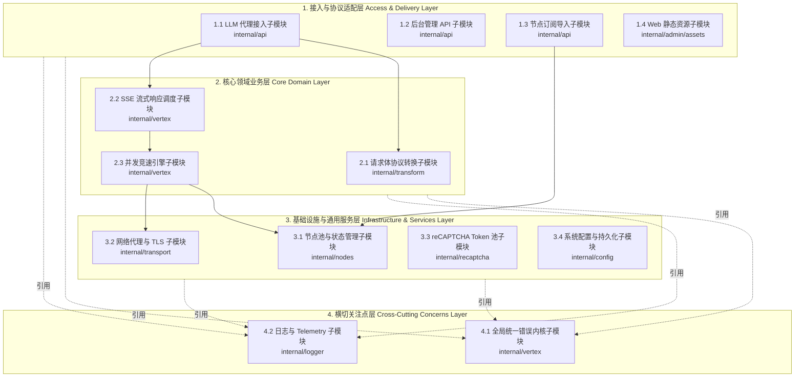

# AGENTS.md — Vertex AI Proxy 工程指南

本文件供 AI Agent 与开发者查阅：记录项目**四层主架构 + 12 个领域子模块**的物理文件映射、单文件行数审查准则以及代码修改后的校验指令。

---

## 一、 架构总览（四层主架构 + 12 领域子模块）



## 二、 物理文件映射总表

| 主层分类 | 序号 | 领域子模块 | 主要文件与职责切片 |
| :--- | :--- | :--- | :--- |
| **1. 接入与协议适配层** | 1.1 | LLM 代理接入 | `gemini_handler.go`、`chat_handler.go`、`image_handler.go`、`audio_handler.go` |
| | 1.2 | 后台管理 API | `admin_nodes_crud.go`、`admin_nodes_action.go`、`admin_handler.go` |
| | 1.3 | 节点订阅导入 | `admin_import_uri.go`、`admin_import_v2ray.go`、`admin_import_clash.go`、`admin_import_parser.go` |
| | 1.4 | Web 静态资源 | `base.css` / `components.css` / `pages.css`、`page-nodes-api.js` / `page-nodes-ui.js`、`page-appearance-api.js` / `page-appearance-ui.js` |
| **2. 核心领域业务层** | 2.1 | 请求体协议转换 | `request_text.go`、`request_media.go`、`toolcall.go` |
| | 2.2 | SSE 流式响应调度 | `stream_chat.go`、`stream_scanner.go`、`stream_transform.go` |
| | 2.3 | 并发竞速引擎 | `race_engine.go`、`racing.go` |
| **3. 基础设施与通用服务** | 3.1 | 节点池与状态管理 | `store_mem.go`、`store_db.go`、`store_health.go` |
| | 3.2 | 网络代理与 TLS | `codec_uri.go`、`codec_protocols.go`、`sing_box_builder.go`、`sing_box_dialer.go` |
| | 3.3 | reCAPTCHA Token 池 | `recaptcha.go`、`pool.go` |
| | 3.4 | 系统配置与持久化 | `config.go`、`provider.go` |
| **4. 横切关注点层** | 4.1 | 全局统一错误内核 | `internal/vertex/errors.go` |
| | 4.2 | 日志与 Telemetry | `internal/logger/logger.go`、`internal/telemetry/client.go` |

> 说明：`internal/` 保持物理目录扁平，新增功能或重构切片需遵循 **package 内按文件名语义切分** 原则（零破坏重构），不改变包名与对外导出签名。

## 三、 单文件规模分级审查线

| 规模区间 | 判定 |
| :--- | :--- |
| < 300 行 | 绿色健康区（理想状态） |
| 300 ~ 400 行 | 正常核心业务区 |
| 400 ~ 500 行 | 预警审视区（检查多重职责，能拆则拆） |
| > 500 行 | 特许例外区（纯数据映射表、测试套件 ≤600 行、不可分割单一协议解析器） |

## 四、 校验指令（修改代码后必须执行）

- 单包测试：`go test ./internal/<pkg>/...`
- 全量测试：`go test ./...`
- 静态检查：`go vet ./...`
- 全功能构建（Sing-Box / UTLS / QUIC 需要构建标签）：

  ```powershell
  go build -tags "with_utls with_quic" -o vertex-proxy.exe ./cmd/vproxy
  ```

- 单文件行数复查（非测试文件 >500 行）：

  ```powershell
  Get-ChildItem -Recurse -Include *.go -Exclude "node_modules",".git",".kilo","dist" | Where-Object { $_.FullName -notmatch '\\\.kilo\\' -and $_.FullName -notmatch '_test\.go$' } | Select-Object -Property FullName, @{Name="Lines";Expression={(Get-Content $_.FullName | Measure-Object -Line).Lines}} | Where-Object { $_.Lines -gt 500 }
  ```

## 五、 关键约定

- **注释语言**：代码注释、逻辑说明使用简体中文；语法、变量名、函数名保持英文。
- **测试指令**：任何代码修改完成后，必须先运行受影响包测试；重大改动需运行全量测试。
- **构建标签**：涉及 Sing-Box / UTLS / QUIC 的完整功能构建与测试必须携带 `-tags "with_utls with_quic"`。
