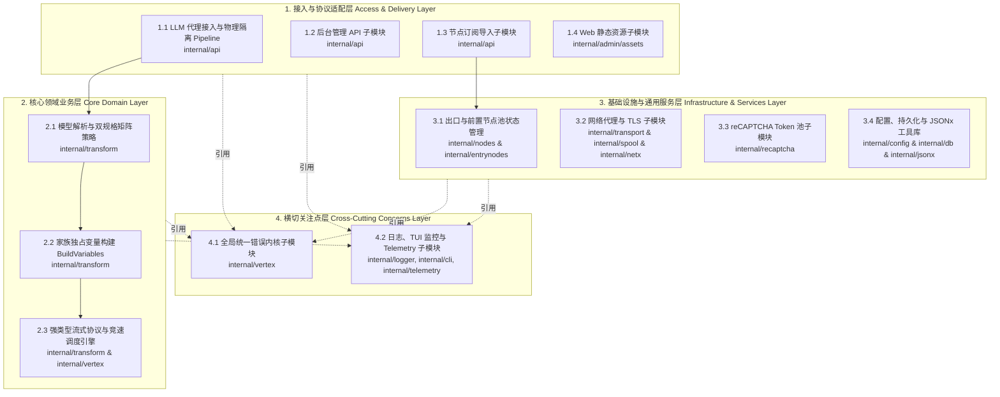

# AGENTS.md — Vertex AI Proxy 工程指南

本文件供 AI Agent 与开发者查阅：记录项目**四层主架构 + 12 个领域子模块**的物理文件映射、单文件行数审查准则以及代码修改后的校验指令。

---

## 一、 架构总览（四层主架构 + 12 领域子模块）



## 二、 物理文件映射总表

| 主层分类 | 序号 | 领域子模块 | 主要文件与职责切片 |
| :--- | :--- | :--- | :--- |
| **1. 接入与协议适配层** | 1.1 | LLM 代理接入与物理隔离 Pipeline | **Gemini 原生 REST 入口与路由**：`gemini_handler.go`（`/v1beta/models/*`、`/v1beta1/models/*`、`/v1alpha/models/*`、`/v1/models/*` 入口分流）、`handler.go`、`server.go`<br>**物理隔离专属调度 Pipeline**：`core_pipeline_text.go`（文本真流式/非流式）、`core_pipeline_image.go`（生图及单包聚合流式守护）、`core_pipeline_audio.go`（语音 TTS 纯二进制交付）<br>**认证与流控中间件**：`auth.go`、`middleware.go`、`fakestream.go` |
| | 1.2 | 后台管理 API | `admin_nodes_crud.go`、`admin_nodes_action.go`、`admin_proxy_nodes.go`（前置代理节点管理）、`admin_settings.go`、`admin_keys.go`、`admin_auth.go`、`admin_handler.go`、`nodes_registry.go` |
| | 1.3 | 节点订阅导入 | `admin_import.go`、`admin_import_uri.go`、`admin_import_v2ray.go`、`admin_import_clash.go`、`admin_import_parser.go`、`admin_import_util.go` |
| | 1.4 | Web 静态资源 | `admin.html`、`base.css` / `components.css` / `pages.css` / `admin.css`、`admin.js` / `api.js` / `utils.js`、`page-overview.js` / `page-nodes-api.js` / `page-nodes-ui.js` / `page-appearance-api.js` / `page-appearance-ui.js` / `page-settings.js` / `page-models.js` / `page-keys.js` / `page-logs.js` |
| **2. 核心领域业务层** | 2.1 | 模型解析与双规格矩阵策略 | **统一模型解析器**：`model_resolver.go`（GCP 规范前缀剥离、假非流修饰剥离、别名归一与家族绑定：`FamilyText` / `FamilyImage` / `FamilyAudio`）<br>**能力规格矩阵白名单**：`text.go`（`TextModelSpec`）、`image.go`（`ImageModelSpec`）<br>**强类型 DTO 与 Schema 定义**：`dto.go`、`media_typed.go`、`schema.go`、`citation.go`、`strutil.go`<br>**模型家族自治策略（全生命周期解耦）**：`strategy.go`、`strategy_text.go`（文本/思考）、`strategy_image.go`（生图/混模）、`strategy_audio.go`（TTS 语音）、`policy.go`、`thinking.go`、`signature.go` |
| | 2.2 | 家族独占变量构建 | `request_variables.go`（提供路由包装 `BuildGeminiVariablesTyped` / `BuildGeminiVariables`），实际构建由三大家族策略自治实施：<br>- **文本家族**（`strategy_text.go`）：同 Role 连续消息合并、空 Part 过滤、历史思维链签名注入、TrailingModelFix、系统指令降级<br>- **生图家族**（`strategy_image.go`）：生图正向白名单抽取、硬性清空 Tools / ThinkingConfig<br>- **语音家族**（`strategy_audio.go`）：AUDIO 模态提纯、硬性清空/拦截 Tools / ThinkingConfig |
| | 2.3 | 强类型流式协议与竞速调度引擎 | **核心调度与竞速引擎**：`stream_chat.go`、`stream_transform.go`（UNSPECIFIED 清洗与上游 Gemini SSE 增量解析）、`stream_scanner.go`、`race_engine.go` / `racing.go`（泛型 `RunRace[T]`、家族动态超时 `CalculateIdleTimeouts` 与增量有效性断言 `IsValidChunk` / `IsValidResponse` 竞速判定） |
| **3. 基础设施与通用服务** | 3.1 | 出口与前置节点池状态管理 | **出口竞速节点池**：`internal/nodes`（`store_mem.go`、`store_db.go`、`store_health.go`）<br>**前置代理节点池**：`internal/entrynodes`（`store_mem.go`、`store_db.go`、`store_health.go`） |
| | 3.2 | 网络代理与 TLS | **协议编解码与 Dialer**：`codec_uri.go`、`codec_protocols.go`、`sing_box_builder.go`、`sing_box_dialer.go`、`dialer.go`、`socks5_loopback.go`<br>**连接池与客户端**：`client.go`、`headers.go`、`node.go`、`internal/spool`（TLS 会话池与多路复用）、`internal/netx`（平台网络适配） |
| | 3.3 | reCAPTCHA Token 池 | `recaptcha.go`、`pool.go` |
| | 3.4 | 配置、持久化与 JSONx 工具库 | **配置与模型预设**：`internal/config`（`config.go`、`provider.go`、`models.go`、`static_provider.go`）<br>**SQLite 数据库持久化**：`internal/db`（`db.go`）<br>**高性能 JSON 工具库**：`internal/jsonx`（高性能 JSON 序列化/反序列化工具封装） |
| **4. 横切关注点层** | 4.1 | 全局统一错误内核 | **错误分类与归一化内核**：`internal/vertex/errors.go`（`NormalizeError`、`VertexError` 归一化 Network/Context/Safety/EmptyResponse/Internal 错误）、`internal/vertex/client.go` |
| | 4.2 | 日志、TUI 监控与 Telemetry | `internal/logger/logger.go`、`internal/cli`（`tracker.go`、`tui_model.go` TUI 终端监控面板）、`internal/telemetry/client.go` |

> 说明：`internal/` 保持物理目录扁平，新增功能或重构切片需遵循 **package 内按文件名语义切分** 原则（零破坏重构），不改变包名与对外导出签名。

## 三、 单文件规模分级审查线与测试规范

| 规模区间 | 判定 |
| :--- | :--- |
| < 300 行 | 绿色健康区（理想状态） |
| 300 ~ 400 行 | 正常核心业务区 |
| 400 ~ 500 行 | 预警审视区（检查多重职责，能拆则拆） |
| > 500 行 | 特许例外区（纯数据映射表、不可分割单一协议解析器） |

> **说明**：行数线为**预警指导指标**而非硬性阻断红线。代码治理核心原则是**单一职责原则（SRP）**与**高内聚低耦合**。严禁为了凑行数而盲目拆分逻辑紧密的代码块或削减有效测试用例。

### 测试文件专项规范：
1. **行数上限与弹性**：单个 `*_test.go` 文件原则上建议控制在 **600 行**以内。若包含大量表驱动测试数据（Table-Driven Test Fixtures）或 Mock 报文，且保持单一测试职责，可作为合理例外保留；对于混合了多子场景的超长测试，需按子场景拆分（如 `sing_box_dialer_test.go` 与 `sing_box_dialer_diag_test.go`）。
2. **旁路测试原则（Colocated Testing）**：测试代码必须与被测业务逻辑处于同一 package，并采用 1 对 1 文件命名对齐（如 `auth.go` 对应 `auth_test.go`）。**严禁创建 `refactor_test.go`、`temp_test.go` 或 `fix_test.go` 等临时性/大一统测试文件**。重构或临时修复新增的测试用例必须在验证后及时归位至对应模块的标准测试文件中。
3. **测试执行性能**：单元测试单用例耗时原则上控制在 **500ms** 以内。**严禁硬编码大额休眠（如 `time.Sleep(10 * time.Second)`）**，模拟网络超时或挂起须使用 `context.WithTimeout` 或 Mock 时间控制。

## 四、 校验指令（修改代码后必须执行）

- 单包测试：`go test ./internal/<pkg>/...`
- 全量测试：`go test ./...`
- 静态检查：`go vet ./...`
- 静态分析（**告警必须归零**，U1000 / S1009 等一律清零后再提交）：`staticcheck ./...`
- 聚合静态检查（gopls 编辑器分析器的命令行等价物，覆盖 `writestring` / `unusedparams` / `simplifycompositelit` / `modernize`(b.Loop)，**告警必须归零**）：`go run ./scripts/gochecks`
- 全功能构建（Sing-Box / UTLS / QUIC 需要构建标签）：

  ```powershell
  go build -tags "with_utls with_quic" -o vertex-proxy.exe ./cmd/vproxy
  ```

- 单文件行数复查（非测试文件 >500 行）：

  ```powershell
  Get-ChildItem -Recurse -Include *.go -Exclude "node_modules",".git",".kilo","dist" | Where-Object { $_.FullName -notmatch '\\\.kilo\\' -and $_.FullName -notmatch '_test\.go$' } | Select-Object -Property FullName, @{Name="Lines";Expression={(Get-Content $_.FullName | Measure-Object -Line).Lines}} | Where-Object { $_.Lines -gt 500 }
  ```

### 静态分析门禁约定（防回潮）

1. **提交门禁**：仓库启用 `.githooks/pre-commit` 钩子（`git config core.hooksPath .githooks`），提交前自动执行 `go vet` + `staticcheck` + `gochecks`，告警非零即阻止提交。**任何人（含 Agent）提交前必须保证三者输出为空**。
2. **新增/修改代码要求**：新增导出函数不得留下"仅测试引用"的死代码；删除代码时同步清理随之失效的 import（`go build` / `go test` 会兜底抓出）。新增参数必须被使用或命名为 `_`（`gochecks` 的 `unusedparams` 会拦截）；字符串拼接严禁用 `sb.WriteString(a + b)` 形式（`gochecks` 的 `writestring` 会拦截）；嵌套复合字面量省略可推断类型（`gofmt -s` / `gochecks` 的 `simplifycompositelit`）；基准测试循环使用 `b.Loop()`（`gochecks` 的 `modernize` 会拦截）。
3. **gochecks 工具说明**：`scripts/gochecks/` 为挂在根模块下的聚合检查器（无独立 go.mod，直接 `go run ./scripts/gochecks`），豁免规则对齐 gopls 行为（接口实现方法参数、方法接收者不报）。`infertypeargs` 检查器依赖完整类型推断、仅存在于 gopls 内部，无命令行等价物，依靠编辑器提示人工处理（无行为风险）。若需新增检查项，在 `scripts/gochecks/main.go` 注册进 `checkers` map（同类型 AST 检查器聚合于单文件，行数 >400 时再按检查项拆分），同步更新本文件与 `.githooks/pre-commit` 注释。
4. **导出死代码巡检（staticcheck 盲区）**：staticcheck 的 U1000 不检查导出符号，需季度性运行 `scripts/deadcode-check.ps1` 全程序死代码甄别：
   - `[DEAD]` 清单（生产+测试零引用）→ 人工复核后删除；
   - `[TEST-ONLY]` 清单（测试专用 API，如 `config.StaticProvider`、`nodes.ResetState`）→ 必须保留；
   - 注意脚本短名匹配盲区：定义在 `_test.go` 内的未使用函数会自引用误判，需结合 `staticcheck` U1000 结果交叉确认。

## 五、 关键架构铁律与约定

1. **纯 Gemini 原生 REST 契约铁律（Gemini Native Only）**：全链路采用 Gemini 原生 REST 规范（端点 `/v1beta/models/*`、`/v1beta1/models/*` 等），彻底剥离 OpenAI 等中转兼容层，所有入站及出站交互严格对齐 Gemini 强类型 `GeminiRequest` / `GeminiResponse` / `GeminiChunk` 数据契约。
2. **唯一模型解析口铁律（Single Model Resolver）**：所有入站请求的模型名称解析必须统一经由 `ModelResolver.ResolveModel` (`model_resolver.go`) 处理，统一完成 GCP 规范前缀剥离、假非流修饰剥离、别名归一与家族绑定（`FamilyText` / `FamilyImage` / `FamilyAudio`），入口处消除任何硬编码字符串判断。
3. **物理隔离 Pipeline 铁律（Dedicated Family Pipelines）**：不同模型家族在 API 调度层彻底物理隔离（`core_pipeline_text.go`、`core_pipeline_image.go`、`core_pipeline_audio.go`），严禁跨家族逻辑交织与单体核心文件复辟。
4. **家族自治与双规格矩阵铁律（Family Autonomy & Dual Spec Matrix）**：
   - **双模型规格白名单矩阵**：`text.go` (`TextModelSpec`) 与 `image.go` (`ImageModelSpec`) 分别维护文本与生图家族的硬性能力边界；
   - **全生命周期策略**：通过各家族 `ModelStrategy` 独立实施 `Enhance`（默认参数与模态注入）、`Validate`（白名单矩阵硬拦截）、`Prepare`（出口前特化清洗）与 `BuildVariables`（家族独占 variables 构建）。
5. **家族独占变量正向构建铁律（Dedicated BuildVariables）**：
   - **文本家族**：实施同 Role 连续消息合并、空 Part 过滤、历史思维链签名注入、TrailingModelFix 与系统指令降级；
   - **生图/语音家族**：采用正向白名单参数提取，硬性清空无关 Tools / ThinkingConfig，杜绝跨家族变量污染。
6. **强类型与零 map 往返铁律（Strong Typing & Zero Map Roundtrip）**：核心领域业务层必须维持强类型 `struct` 传递（利用指针 + `omitempty` 杜绝脏数据污染），严禁退回 `map[string]any` 中转与 in-place 修改范式。
7. **竞速引擎零模型感知铁律（Model-Agnostic Race Engine）**：竞速引擎泛型化 (`RunRace[T]`)，零模型业务感知；响应有效性与动态超时判定退回下行阶段由各家族策略 (`CalculateIdleTimeouts`、`IsValidChunk` / `IsValidResponse`) 自治实施。
8. **统一错误内核与安全拦截放行铁律（Unified Error & Safety Pass-through）**：上游响应通过 `internal/vertex/errors.go` 归一化分类 (`NormalizeError`)。安全拦截等极性拦截报文予以结构化放行，确保客户端能准确识别安全拒绝原因而不会误判为网络崩溃。
